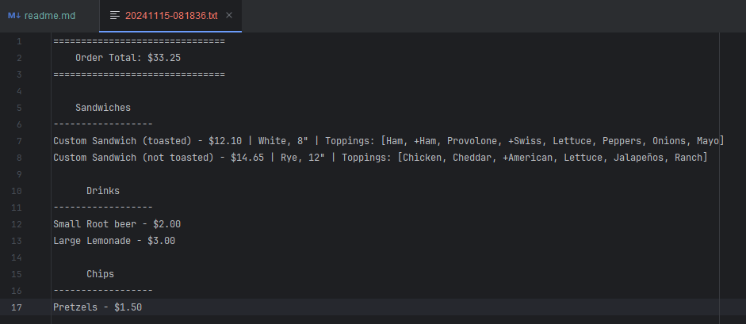
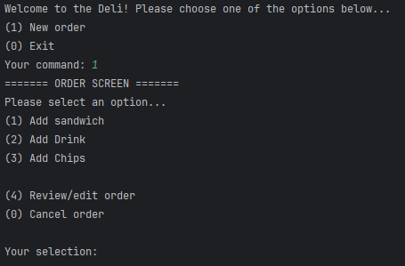
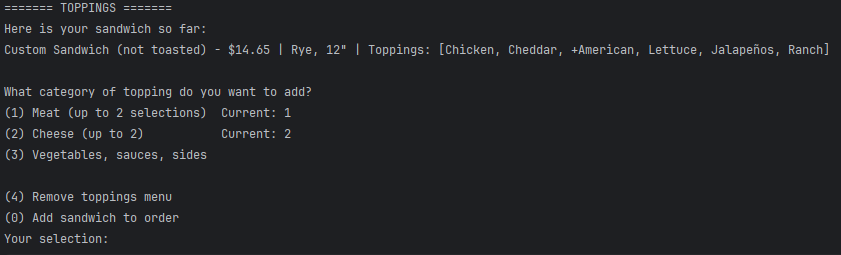
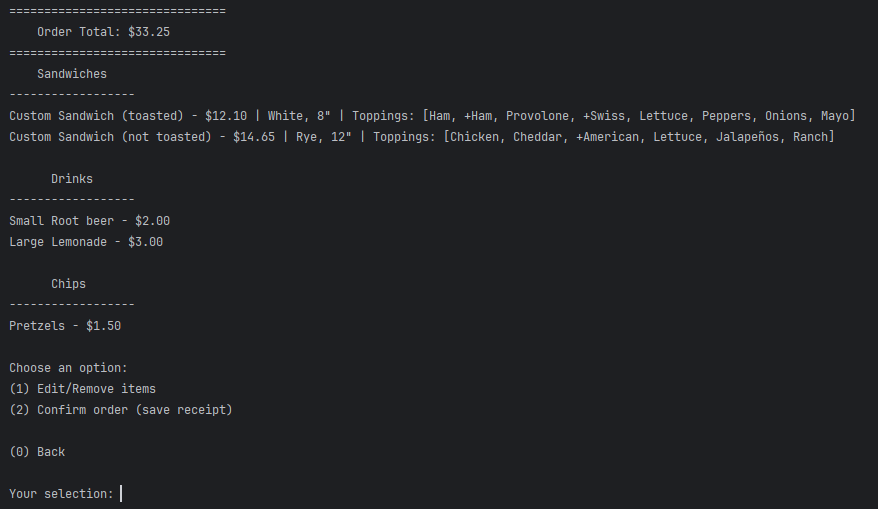
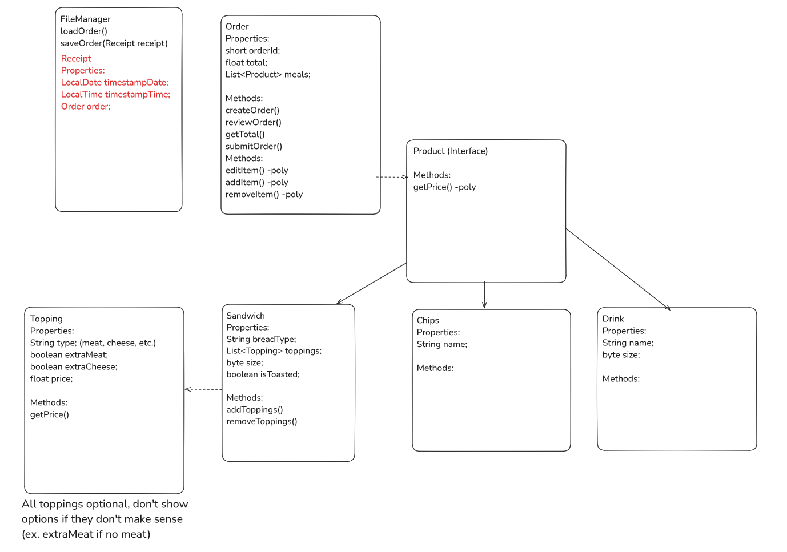

# The Deli

## Overview
Welcome to **The Deli**! This is my command line application, written in Java, that functions as a point-of-sale system
allowing users to build an order consisting of:
- One or more sandwiches with various toppings, 
- One or more drinks and/or chips from a small variety
- The ability to save a timestamped itemized receipt to a dedicated folder

## Features
- Add sandwiches with customizable toppings (meats, cheeses, vegetables, sauces, etc.).
- Select drinks and chips to include in the order.
- Display and review the current order, categorized by item type.
- Save an itemized order receipt to a `.txt` file with a timestamped name.
- Remove or edit individual items from the order.

---

## Usage

1. Run the program and follow the prompts to:
   - Add sandwiches with up to 2 meats, cheeses, and unlimited other toppings.
   - Select drinks and chips to complete the order.
   - Review your order and make changes before finalizing.
2. Save the receipt, which will be stored as a timestamped `.txt` file in the `receipts` folder.

## Code Overview

### Project Structure
- `src/com/ps` - Source files for the application.
  - **`Main.java`**: Entry point for the application.
  - **`UserInterface.java`**: Handles user input and menu navigation.
- `com/ps/structure`
  - **`Sandwich.java`**: Represents a sandwich with customizable toppings.
  - **`Topping.java`**: Represents individual toppings for sandwiches.
  - **`Drink.java`**: Represents drinks in the order.
  - **`Order.java`**: Manages the list of items in the user's order.
- `com/ps/filemanagement`
  - **`FileManager.java`**: Handles saving receipts to `.txt` files.

### Key Classes and Methods
- **`Order`**:
   - `addProduct(Product product)`: Adds an item to the order.
   - `getProducts()`: Retrieves all products in the order.
- **`Sandwich`**:
   - `addTopping(Topping topping)`: Adds a topping to the sandwich.
   - `removeTopping(int index)`: Removes a topping by index.
   - `getToppings()`: Returns the list of toppings.
- **`FileManager`**:
   - `saveOrderReceipt(Order order)`: Saves the current order to a `.txt` file.

## Example Receipt
Here is an example of the receipt file that is created when you save an order. It is identical to what you see in the 
review order screen.


## Other Screenshots
### Menus expanded:



### Adding toppings to a sandwich: 



### Order review screen:



## Notable Piece of Code
```
public static byte handleMenuInputMismatch(String prompt) {
        byte userInput = -1;
        boolean validInput = false;

        while (!validInput) {
            System.out.print(prompt);
            try {
                userInput = commandScan.nextByte();
                validInput = true;
            } catch (InputMismatchException e) {
                System.out.println("Invalid entry, try again.");
                commandScan.nextLine();
            }
        }
        return userInput;
    }
```
This is a method I created to handle exceptions related to input mismatch exceptions

## Class Diagram



## Future Enhancements
- Add more drink and chip options.
- Implement discounts and special offers.
- Offer combos and preset sandwiches
- Enhance the user interface with a graphical version.
- Save orders to a database for long-term storage.
